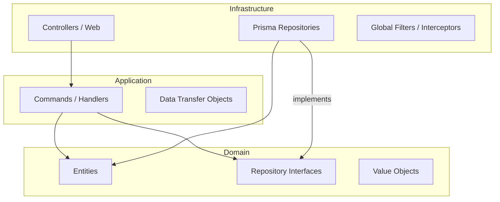
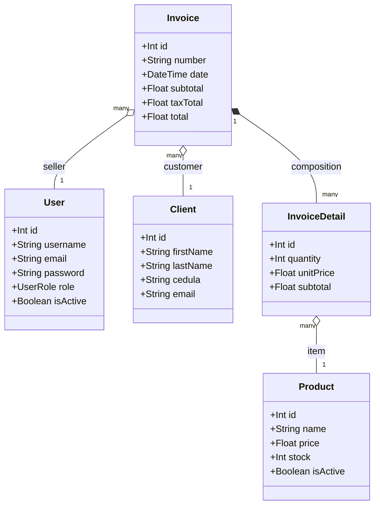
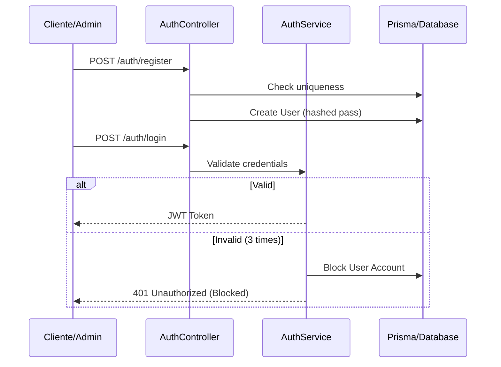

# Backend Architecture Diagrams (POS API)

## Layered Architecture (Hexagonal/Clean)
Muestra la separación de responsabilidades y el flujo de dependencias hacia el dominio.

## Data Domain Model
Diagrama de clases para las entidades persistidas y sus relaciones.

## Security Flow (Authentication)
Flujo de registro y login con bloqueo automático.

